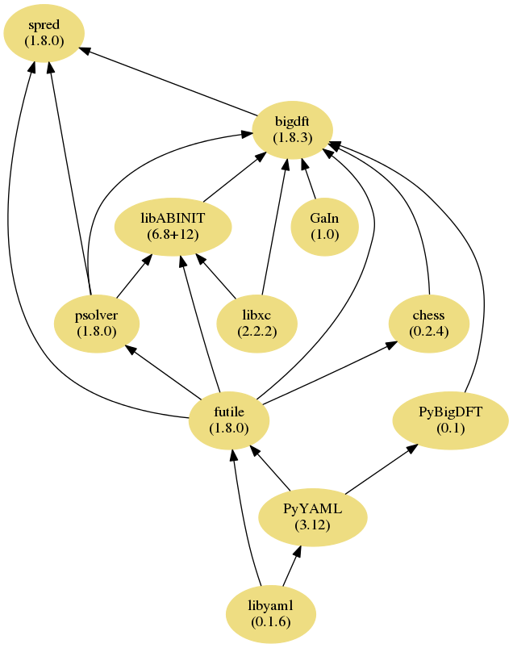

The BigDFT suite
================

From version 1.8.0, that can be downloaded either from the provided
tarball or by having a launchpad account, via

``bzr branch lp:bigdft``

the build system of BigDFT has been modified. Instead of building the
code with one single configure line, the code is now built as a suite of
different packages.

In this scheme we might see how the BigDFT code is separated. This was
also the same compiling procedure that has been used for the 1.7.x
versions of the code. The figure describes the interdependencies among
these packages. Let us describe each of the packages which are depicted
here. The packages might be separated in *upstream* contributions and
*native* contributions

Upstream packages
-----------------

-  ``libyaml``: this library is used to parse the
   `yaml markup language <http://yaml.org/>`_, that is used in the
   BigDFT input files;
-  ``PyYaml``: this is a `Python module <https://pyyaml.org/>`_ which makes
   possible to convert yaml into python objects. This part is mainly
   used for postprocessing purposes as BigDFT logfile also comes in yaml
   format;
-  ``libXC``:
   this `library <http://www.tddft.org/programs/octopus/wiki/index.php/Libxc>`_
   handles most of the XC functionals that can be invoked from
   BigDFT runs;
-  ``GaIn``: this library handles analytic integrals of common operators
   between Gaussian Functions. It does not perform low-level operations
   and can be linked separately;

Native packages
---------------

-  :ref:`futile <futile:futile_index>`:  a library
   handling most common FORTRAN low-level operations, like memory
   management, profiling routines, I/O operations. It also supports yaml
   output and parsing for fortran programs. It also provides wrappers
   routines to MPI and linear algebra operations. This library is
   intensively used in BigDFT packages;
-  ``CheSS``: A module for performing Fermi Operator Expansions via
   Chebyshev Polynomials, released as a separate project on
   `Launchpad <https://launchpad.net/chess>`_
-  ``psolver``: a flexible real-space Poisson Solver based on
   Interpolating Scaling Functions. It constitutes a fundamental
   building block of BigDFT code, and it can also be used separately and
   linked to other codes. It also internally uses the ``futile`` library
   for the I/O.
-  ``libABINIT``: this is a subsection of files coming from
   `ABINIT <http://www.abinit.org>`_ software package, to which
   BigDFT has been coupled since the early days. It handles different
   parts like symmetries, ewald corrections, PAW routines, density and
   potential mixing routines and some MD minimizers. Also some XC
   functionals, initially natively implemented in the ``ABINIT`` code,
   are also coded in this library. Also this library uses the ``futile``
   code, through the (experimental) PAW section.
-  `BigDFT <http://www.bigdft.org>`_: the core routines of this
   package;
-  ``spred``: a library for structure prediction tools, that is compiled
   on top of BigDFT routines.

In the previous versions, all these different packages were compiled
with the same configuration instructions. With the present version, each of
the code sections described above can be considered as a separate
package (some more are upcoming), which improves modularity between code
sections and reduces side-effects. In addition, each package can now be
compiled with different installation instructions.

We have used a building suite tool based on the
`Jhbuild <https://wiki.gnome.org/action/show/Projects/Jhbuild?action=show&redirect=Jhbuild>`_,
which is regularly used by developers of ``gnome`` project. We have
re-adapted/added some of the functionality of the ``jhbuild`` package to
meet the needs of our package. Let us now present how the installation
should work. We have prepared a script, called ``Installer.py``, which
should take care on the main actions related to BigDFT suite compilation
and installation. Let us investigate how it works.

.. _installer-script-label:

Usage of the ``Installer.py`` script
====================================

As mentioned above the BigDFT suite is compiled by means of instructions
from the Python script ``Installer.py``. Such script triggers the usage
of the ``jhbuild.py`` Python file which is at the basis of the
``jhbuild`` project mentioned above. There are various actions available in
addition to the ``build`` command. To know them, just type

.. program-output:: ./Installer.py help
   :prompt:

So for example, to build the tarball of bigdft-suite out of a valid
branch, you may type

 ``Installer.py dist bigdft``

You should have eventually a tarfile named ``bigdft-suite.tar.gz`` in
the build tree. Such tarfile may be used to build the suite in another
machine.

Few important informations:

-  This script is intendent to provide the **end-user** with a
   functional set of executables coming from the suite packages. It has
   to be used to (re-)work on the entire suite, not a single package
   only.
-  It does not replace the traditional ``make`` commands. A developer of
   a single package, say ``futile`` for example, should first compile
   \*and install (``make install``) the package in its build directory,
   then rebuild the dependencies. In such a case, it is advised to run
   ``Installer.py clean`` first, then the ``build`` command would work.

Installing from a ``configure`` line
====================================

As written above, packages were already configured and compiled with a
previous BigDFT version. Therefore we have prepared a compilation method
to compile the 1.8.x build system from a configure line. See in the
`examples <examples of compilations on different architectures>`__ page
some of the configure lines which were already tested on different
machines.

The principle of this installer is to execute, in a build directory
different of the source one, instead of the configure script, the
following command:

``<path_to_sources>/Installer.py build -c``

Let us consider the example of the ``pilipili`` machine (internal L\_Sim
lab machine). Clearly, environment modules still have to be loaded:

``module load intel/13.0.1 impi/4.1.0.024``

Then the installer script can be used with the following command:

| ``<path_to_sources>/Installer.py build -c 'FCFLAGS=-O2 -openmp' \``
| ``'--with-ext-linalg=-L/opt/intel/composer_xe_2013.1.117/mkl/lib/intel64 -lmkl_rt -lmkl_scalapack_lp64 -lmkl_blacs_openmpi_lp64 -liomp5 -lm' \``
| ``'--enable-opencl' 'CC=mpicc' \``
| ``CFLAGS='-openmp' 'CXX=mpicxx' 'FC=mpifc' 'F77=mpif77' 'FCLIBS= '``

The following message dialog will appear:

| ``Configuration chosen for the Installer:\``
| `` Hostname: pilipili``
| `` Source directory: /home/athelas/genovese/work/BigDFT/1.8\``
| `` Compiling from a branch: True\``
| `` Build directory: /local/genovese/binaries/1.8-ocl\``
| `` Action chosen: build\``
| `` Verbose: False\``
| `` Jhbuild baseline: <path_to_sources>/jhbuild.py \``
| `` Configuration options:\``
| ``   Source: Environment variable 'BIGDFT_CONFIGURE_FLAGS'\``
| ``   Value: '"FCFLAGS=-O2 -openmp" "--with-ext-linalg=-L/opt/intel/composer_xe_2013.1.117/mkl/lib/intel64 -lmkl_rt -lmkl_scalapack_lp64 -lmkl_blacs_openmpi_lp64 -liomp5 -lm" "--enable-opencl" "CC=mpicc" "CXX=mpicxx" "FC=mpifc" "F77=mpif77" "FCLIBS= " '\``
| ``Do you want to continue (Y/n)?``

The Installer script has detected the different compilation options. It
has filled the environment variable ``BIGDFT_CONFIGURE_FLAGS`` with the
options passed after the ``-c`` option in the command line. By typing
``Y`` the bigdft bundle will build.

As we did not specified the ``-v`` option (type ``./Installer.py help``
for the available commands and options), the code will be built in
silent mode (this would correspond to the ``tinderbox`` option of
JhBuild. You should have the following information in the output:

| ``List of modules to be treated: ['libyaml', 'futile', 'psolver', 'libxc', 'libABINIT', 'GaIn', 'bigdft', 'spred']``
| ``libyaml : ['checkout', 'configure', 'build', 'install']``
| ``futile : ['checkout', 'configure', 'build', 'install']``
| ``psolver : ['checkout', 'configure', 'build', 'install']``
| ``libxc : ['checkout', 'configure', 'build', 'install']``
| ``libABINIT : ['checkout', 'configure', 'build', 'install']``
| ``GaIn : ['checkout', 'configure', 'build', 'install']``
| ``bigdft : ['checkout', 'configure', 'build', 'install']``
| ``spred : ['checkout', 'configure', 'build', 'install']``

Then in the directory named ``buildlogs`` of the build tree you might
find the ``index.html`` file that contains the status of the
compilation.

At the end of a successful compilation, you find in the build directory
a file named ``buildrc`` that may be used for future compilation and to
specify more flexible configurations options. See next section for the
details.

Using a configuration file (``rcfile``)
=======================================

The environment variable ``BIGDFT_CONFIGURE_FLAGS`` is a way to indicate
some general options for all modules. A more powerful method is to use a
``rcfile`` configuration file which indicates all possible option for
each module. Some examples are provided in the directory ``rcfiles``.
For advanced features, the different possible options are detailed in
`1 <https://developer.gnome.org/jhbuild/stable/config-reference.html>`__.

The default behaviour (no information)
--------------------------------------

Working with a configuration file is the default behaviour of
``jhbuild``. Therefore it is normally expected to provide a file to the
``Installer.py`` script (see next section on how to do that). If no
files is provided in the command line, the script search for (priority
order):

-  A file named ``buildrc`` in the current build directory;
-  A file in the directory ``rcfiles/`` of the source tree that contains
   the hostname string (or a part if it) in its basename. If multiple
   files satisfy this condition, it offers a choice.

Therefore when asked to proceed for the installation, it is advised to
pay attention in the initial message which is the file chosen for the
configuration.

How to invoke a configuration file
----------------------------------

The name of the configuration file might be specified with the ``-f``
option of the installer. the file might be either specified via its
absolute path, or by its name. In this case, it is searched for in
(priority order):

-  The current working directory;
-  The directory ``rcfiles/`` of the source tree.

Manipulating the configuration file
-----------------------------------

The principle of the configuration file is to provide configure options
which are different for each o the packaged of the suite (called modules
in the ``jhbuild`` spirit). Therefore, to each of the package one must
associate a configure line. Such information is provided in the
dictionary ``module_autogenargs`` of jhbuild, and might be specified as
follows (see e.g. the file ``dynamic.rc``)

``module_autogenargs['libxc'] = "CC=gcc --enable-shared"``

or, alternatively

``module_autogenargs.update({'libxc': "CC=gcc --enable-shared"})``

depending on your taste. If the BigDFT suite is compiled from a
configure line, at the end of the first compilation a ``buildrc`` file
is produced, that can be then used in the following compilations.

The Python syntax of the configuration file
-------------------------------------------

An rcfile is invoked inside the collection of python modules provided by
``jhbuild``. Therefore within this file the python syntax is necessary.
This adds extra features that would otherwise be difficult to implement.
For example, one might define functions that indicate common
configuration options, or that retrieve the current working directory to
define more elaborated configuation lines. For example, in a rcfile we
may found (see for example the file ``mira.rc`` of the distribution):

| ``def fcflags_short():``
| `` return """'FCFLAGS= -g -O3'"""``
| ``[...]``
| ``module_autogenargs.update({``
| ``  'libxc': fcflags_short(),``
| `` [...]``
| `` }``

We here prefer to use return values of functions rather that to define
extra variables in the script as ``jhbuild`` warns if unknown variable
names are found in the configuration file.

Building the executables
========================

There are some practical `examples of compilations on different
architectures <examples of compilations on different architectures>`__
where you might find useful information on how the code has been
compiled on different platforms and for different options.

Linking external software with BigDFT packages
==============================================

From version 1.8.0 on the build system of BigDFT is "generic" in the
sense that it does not only allow the compilation of the main BigDFT
software, but also of various sub-packages. This is useful if one is
only interested in some of the packages distributed with BigDFT.

As an example we will show the compilation of the CheSS package, which
itself depends on futile. It can be downloaded here:
`2 <https://launchpad.net/chess>`__ After downloading the tar.gz execute
the following steps:

| ``tar -xzvf CheSS-0.1.1.tar.gz``
| ``cd CheSS-0.1.1``
| ``mkdir Build``
| ``cd Build``
| ``../Installer.py build chess -d -c FC=``\ \ `` CC=``\ \ `` FCFLAGS=``\ \ `` --with-ext-linalg=``\

A dialogue similar to this one should appear:

| ``Configuration chosen for the Installer:``
| ``  Hostname: stephan-Latitude-E7450``
| ``  Source directory: /home/stephan/Documents/BigDFT/stablebranch``
| ``  Compiling from a branch: True``
| ``  Build directory: /home/stephan/Documents/BigDFT/stablebranch/Build-gnu_debug``
| ``  Action chosen: dist``
| ``  Verbose: True``
| ``  Jhbuild baseline: ../jhbuild.py -f buildrc``
| ``  Configuration options:``
| ``    Source: Configuration file '/home/stephan/Documents/BigDFT/stablebranch/Build-gnu_debug/buildrc'``
| ``Do you want to continue (Y/n)?``

Confirm and wait until the compilation in complete. In order to link now
another software with CheSS, run the command

``../Installer.py link chess``

which should give you an output similar to this one:

| ``--------- Linking line to build with package "chess":``
| ``  -I/home/stephan/Downloads/CheSS-0.1.1/Build/install/include-L/home/stephan/Downloads/CheSS-0.1.1/Build/install/lib -lCheSS-1 -lfutile-1 -lblacs-openmpi -lblacsF77init-openmpi -llapack -lblas -lyaml -lrt -lfutile-1 -lblacs-openmpi -lblacsF77init-openmpi -llapack -lblas -lyaml -lrt``
| ``--------------------------------------------------``

This is the link line that you can now use in your other software to
link with CheSS.

The BigDFT Installer class
==========================

.. autoclass:: Installer.BigDFTInstaller
